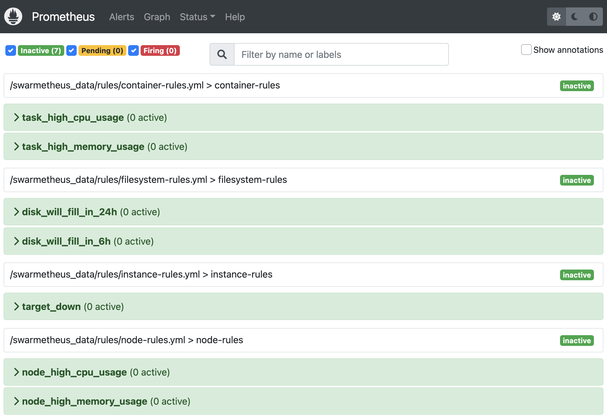

# swarmetheus

Docker Swarm is pretty simple. Wouldn't it be great if Prometheus monitoring for Docker Swarm were just as simple?

## _**Introducing `Swarmetheus`!**_

## _**Dead simple `Prometheus` monitoring for `Docker Swarm`!**_


### _**But wait - there's more!**_

Swarmetheus [basic-example](./examples/basic-example/readme.md) includes:

* cAdvisor
* Node Exporter
* \+ preconfigured alerts!

### _**Want even more?**_

Check out the [bonus-example](./examples/bonus-example/readme.md) to get:

* Traefik
* Alertmanager
* Grafana
* \+ https!

## deploy basic-example

``` sh
# copy the basic-example docker-compose.yml locally
wget https://raw.githubusercontent.com/rjchicago/swarmetheus/master/examples/basic-example/docker-compose.yml
```

``` sh
# stack deploy
docker stack deploy -c docker-compose.yml swarmetheus --prune
```

After a moment, you should have two `swarmetheus` services running:

``` sh
docker service ls
```

``` sh
# example output
ID             NAME                      MODE         REPLICAS   IMAGE                          PORTS
ob9flfd6hs3v   swarmetheus_prometheus    replicated   1/1        prom/prometheus:latest         *:9090->9090/tcp
eiaoee7qnw8v   swarmetheus_swarmetheus   global       1/1        rjchicago/swarmetheus:latest
```

After another moment, you will have several additional side containers running:

``` sh
docker ps -f "name=^swarmetheus-.+$" --format "table {{.ID}}\t{{.Image}}\t{{.Status}}\t{{.Ports}}\t{{.Names}}"
```

``` sh
# example output
CONTAINER ID   IMAGE                              STATUS                   PORTS                    NAMES
4ca200e0165f   prom/node-exporter:v1.3.1          Up 1 minutes             0.0.0.0:9092->9100/tcp   swarmetheus-node-exporter
b7d48af0f418   gcr.io/cadvisor/cadvisor:v0.43.0   Up 1 minutes (healthy)   0.0.0.0:9091->8080/tcp   swarmetheus-cadvisor
63ca59739edb   rjchicago/swarmetheus:latest       Up 1 minutes                                      swarmetheus-health
```

## open

Your `swarmetheus` suite is up and running:

* Prometheus: <http://localhost:9090/>
* cAdvisor: <http://localhost:9091/>
* Node Exporter: <http://localhost:9092/>

## alerts

Many basic alerts are preconfigured:

<http://localhost:9090/alerts>



## bonus-example

To deploy the bonus example, see the [bonus-example](./examples/bonus-example/).

## cleanup

Since `swarmetheus` runs additional containers, it is cleaner to remove those first, then the stack, and finally the volumes:

``` sh
# remove containers
docker container rm -f $(docker ps -f "name=^swarmetheus-.+$" --format "{{.ID}}")
```

``` sh
# remove stack
docker stack rm swarmetheus
```

``` sh
# remove volumes
docker volume rm $(docker volume ls -f "name=^swarmetheus_.+$" --format "{{.Name}}")
```

## Example Prometheus Queries

### Node CPU

``` sh
100 - 100 * avg by(instance, env) (irate(node_cpu_seconds_total{mode="idle"}[5m]))
```

### Node Memory

``` sh
100 * (1 - ((node_memory_MemFree_bytes + node_memory_Cached_bytes + node_memory_Buffers_bytes) / node_memory_MemTotal_bytes))
```

### Container CPU

``` sh
rate(container_cpu_usage_seconds_total{image=~".+"}[5m])*100
```

### Container Memory

``` sh
container_memory_rss{image=~".+"}
```
